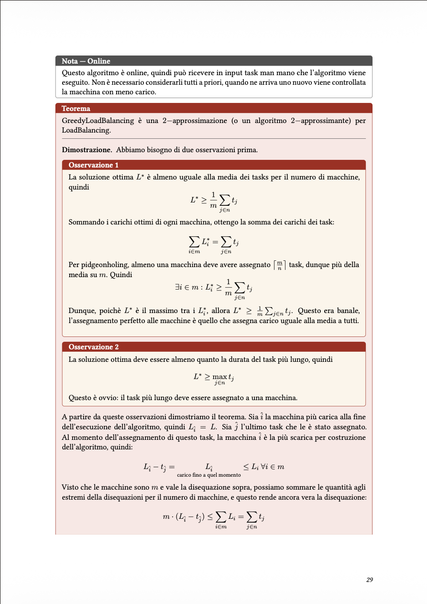
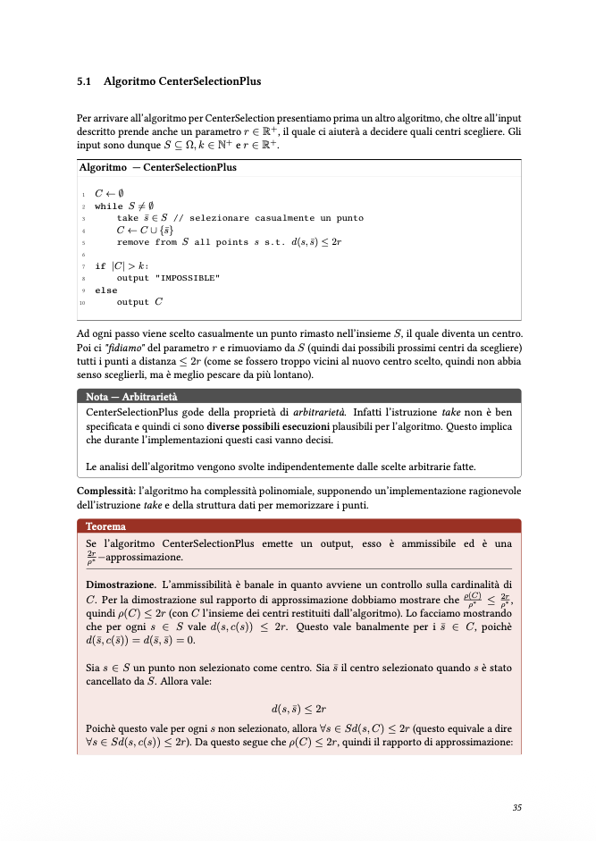

# LaTeX Notes Template

[](https://github.com/fedeRizzi04/latex-notes-template/actions/workflows/latex.yml)
[](https://www.latex-project.org/)
[](LICENSE)

A minimal LaTeX template for lecture/course notes (`notes.tex`), built with `scrbook` and supporting both Italian and English labels (switch via `\dispensalingua` in the preamble).

## How it works

On every push or pull request, the [`latex.yml`](.github/workflows/latex.yml) GitHub Action compiles `notes.tex` and publishes `notes.pdf` as a build artifact.

## Examples

Styled boxes for notes, theorems, proofs and algorithms — ready to use out of the box:

<p align="center">
  
  &nbsp;&nbsp;
  
</p>

## Adding new folders (e.g. images)

The workflow only triggers on changes to specific paths:

```yaml
on:
  push:
    paths:
      - "notes.tex"
      - ".github/workflows/latex.yml"
```

If you add a new folder to the repo (e.g. `images/` for figures included in the document), **you must add that path to `latex.yml`** under both `push.paths` and `pull_request.paths`. Otherwise, changes to files in that folder won't trigger a recompilation.

Example:

```yaml
on:
  push:
    paths:
      - "notes.tex"
      - "images/**"
      - ".github/workflows/latex.yml"
  pull_request:
    paths:
      - "notes.tex"
      - "images/**"
      - ".github/workflows/latex.yml"
```
